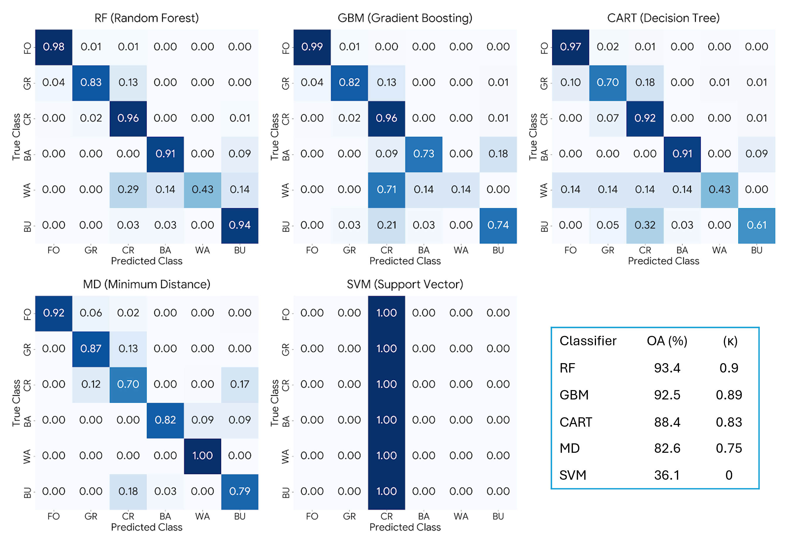
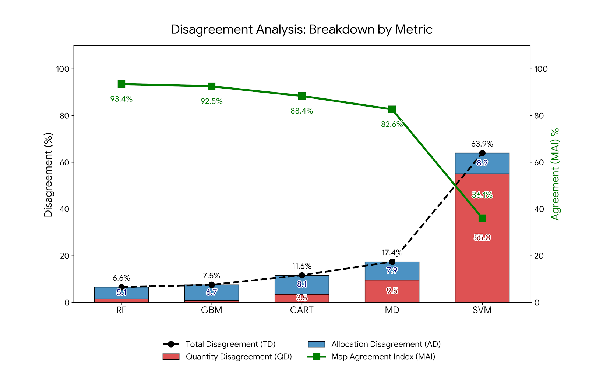

# A Comparative Analysis of Supervised Classifiers in Google Earth Engine: RF, GBM, SVM, CART, and Minimum Distance
## Suam LULC Analysis 2025: Comparative Machine Learning Performance

## 1. Project Overview
This repository hosts the data and source code for a comparative Land Use/Land Cover (LULC) analysis in the Suam region (Mt. Elgon, Kenya/Uganda). The study leverages a high-dimensional feature stack (82 bands) derived from **Landsat 9 OLI/TIRS** to evaluate the performance of five prominent machine learning classifiers:
* **Ensemble Methods:** Random Forest (RF) & Gradient Boosting Machines (GBM)
* **Standard Classifiers:** Classification and Regression Trees (CART), Minimum Distance (MD), & Support Vector Machines (SVM)

## 2. Repository Structure
* **`/scripts`**: Contains the [GEE JavaScript API](scripts/analysis_gee.js) processing chain and [Python Visualization Notebook](scripts/Visualizations_SUAM.ipynb).
* **`/data`**: Contains the `training_points.csv` (2,063 stratified training samples).

---

## 3. Workflow & Reproduction

### Phase I: Satellite Image Processing (Google Earth Engine)
Users can reproduce the feature extraction and classification via the following methods:
1. **Interactive Snapshot:** Access the [Direct GEE Script Link](https://code.earthengine.google.com/9cd46be3da82dc9030a23ac2e354f5ab).
2. **Manual Implementation:** Copy the code from `scripts/analysis_gee.js` and paste it into the [GEE Code Editor](https://code.earthengine.google.com/).

### Phase II: Statistical Accuracy Assessment (Python)
Execute the `scripts/Visualizations_SUAM.ipynb` notebook in a Jupyter environment (VS Code, JupyterLab, or Google Colab) to generate publication-quality figures:

#### Figure 3: Comparative Normalized Confusion Matrices
*Illustrates class-specific omission/commission errors across all five classifiers.- Modified to include an insert table showing OA and K for each classifier*

#### Figure 4: Disagreement Analysis
*Decomposes Total Disagreement (TD) into Quantity Disagreement (QD) and Allocation Disagreement (AD) alongside the Map Agreement Index (MAI).*

#### Figure 5: McNemar’s Statistical Significance Test
*Statistical significance of performance differences between the reference classifier (RF) and the challengers.*

---

## 4. Citation
If you utilize this code or data, please cite the original study:
> *[Full citation placeholder - To be updated upon publication]*

## 5. License
This project is licensed under the **MIT License**.
